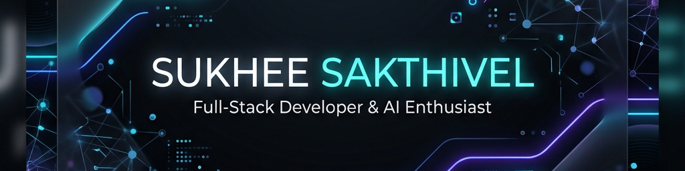
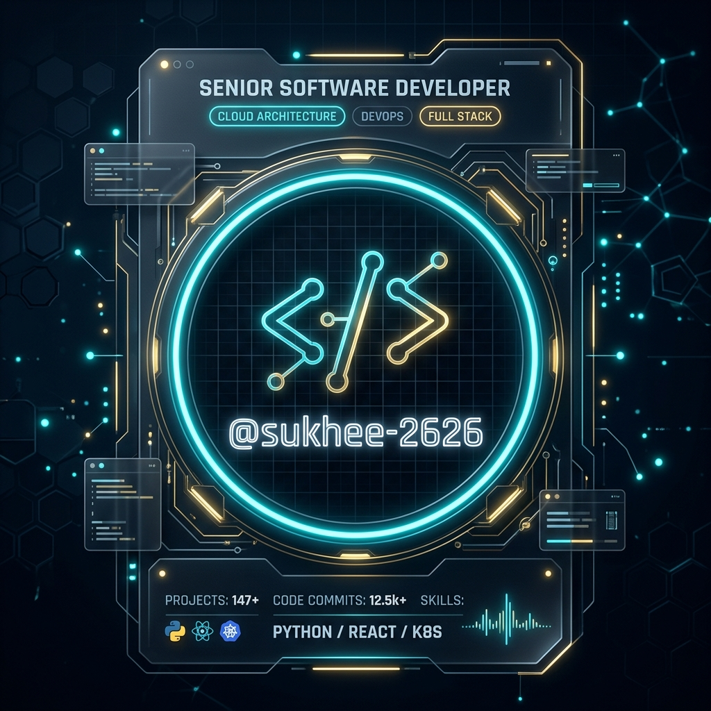

  

  
  

  <b>Google Developer Groups (GDG) Media Team | Computer Science Student | RPA Enthusiast | Exploring Generative AI, Cloud Computing, and Automation | Interested in Vibe Coding and UI/UX Design</b>

  
  
  

---

## 👨‍💻 About Me

* 🎓 **Computer Science Student** at **Sri Krishna Arts and Science College (SKASC)** (2025 - 2028).
* 🎨 **Media & Creative Team Head** at **Google Developer Student Clubs (GDG on Campus SKASC)**.
* 🤖 **RPA & Automation Enthusiast** exploring Generative AI, Cloud Computing, and Workflow Automation.
* 💻 Passionate about **Vibe Coding**, UI/UX design, and rapid prototyping.
* 🌐 Scored **95%** in the **IIT Bombay Spoken Tutorial Java Training Program**.
* ☁️ Certified in Google Cloud: **Set Up a Google Cloud Network** & **Level 3: Generative AI**.

---

## 🏆 Hackathons & Key Projects

<table width="100%">
  <tr>
    <td width="50%" valign="top">
      <h3>🥉 Featastiv AI</h3>
      
<b>Won 3rd Prize at Ideathon – ThinkTank 2026</b>

      
An AI-powered healthcare scheduling and queue management system designed to reduce hospital wait times and elevate patient care.

      <ul>
        <li>Smart scheduling & live queue tracking</li>
        <li>Built in collaboration with Mithra R and Kanishkar M</li>
      </ul>
      <a href="https://lnkd.in/g5aypTxY" target="_blank"><b>👉 View Prototype</b></a>
    </td>
    <td width="50%" valign="top">
      <h3>⛓️ MediChain Spark</h3>
      
<b>GDG TechSprint Hackathon 2025</b>

      
A blockchain-based medical record ecosystem that safely maintains and shares patient health histories across multiple hospitals.

      <ul>
        <li>Guarantees patient record privacy & security</li>
        <li>Implements immutable ledger transparency</li>
      </ul>
      <a href="https://lnkd.in/gvartgug" target="_blank"><b>👉 View Project</b></a> | <a href="https://lnkd.in/gXX_GKmW" target="_blank"><b>Certificate</b></a>
    </td>
  </tr>
  <tr>
    <td width="50%" valign="top">
      <h3>🎓 GDG TechSprint Certificate Portal</h3>
      
Developed the official hackathon certificate portal from scratch, enabling participants to instantly verify, download, and share their credentials on LinkedIn.

      <ul>
        <li>Secure verification via Credential ID & QR codes</li>
        <li>Generates professional PDFs instantly</li>
      </ul>
      <a href="https://lnkd.in/gqbSV8Ay" target="_blank"><b>👉 View Portal</b></a>
    </td>
    <td width="50%" valign="top">
      <h3>📝 AI PRD Generator</h3>
      
A smart tool that leverages generative AI to turn raw product concepts into structured 11-section Product Requirement Documents (PRDs) in seconds.

      <ul>
        <li>Eliminates planning friction for founders & PMs</li>
        <li>Built and launched rapidly using Lovable</li>
      </ul>
      <a href="https://lnkd.in/gT4379-b" target="_blank"><b>👉 Try PRD Generator</b></a>
    </td>
  </tr>
</table>

---

## 🛠️ Tech Stack & Skills

<table>
  <tr>
    <td align="center"><b>Programming Languages</b></td>
    <td>
      
      
      
      
      
      
      
    </td>
  </tr>
  <tr>
    <td align="center"><b>Cloud & Automation</b></td>
    <td>
      
      
      
    </td>
  </tr>
  <tr>
    <td align="center"><b>Design & UI/UX</b></td>
    <td>
      
      
      
    </td>
  </tr>
  <tr>
    <td align="center"><b>Frameworks & Tools</b></td>
    <td>
      
      
      
      
    </td>
  </tr>
</table>

---

## 📊 GitHub Analytics & Showcase

<table border="0" width="100%">
  <tr>
    <td width="50%" align="center" valign="middle">
      
    </td>
    <td width="50%" align="center" valign="middle">
      
    </td>
  </tr>
  <tr>
    <td colspan="2" align="center" valign="middle" style="padding-top: 20px;">
      
<b>✨ Futuristic Developer Badge & Identity Card ✨</b>

      
    </td>
  </tr>
</table>

---

  Generated with ❤️ using modern profile design systems. Keep building, keep innovating! 🚀

